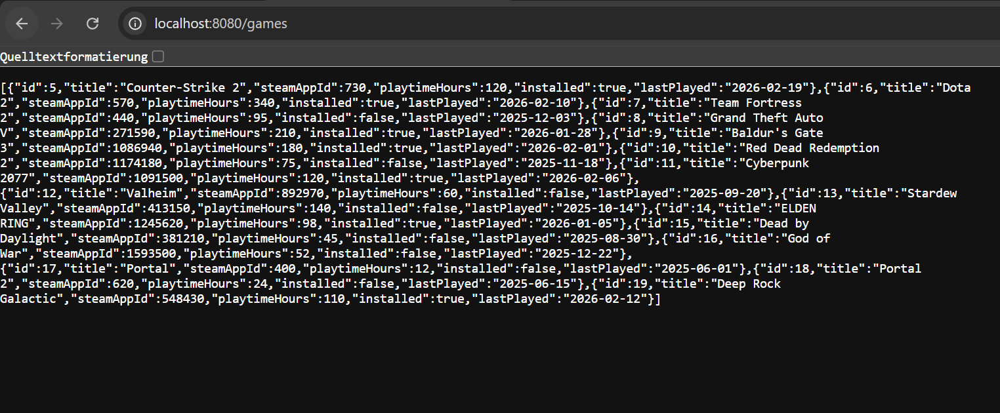
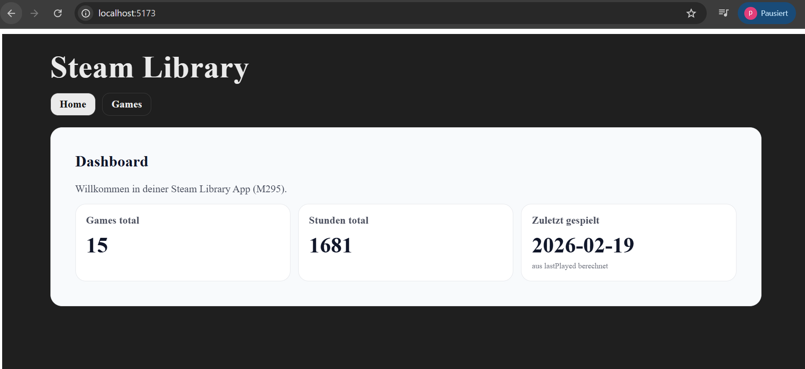
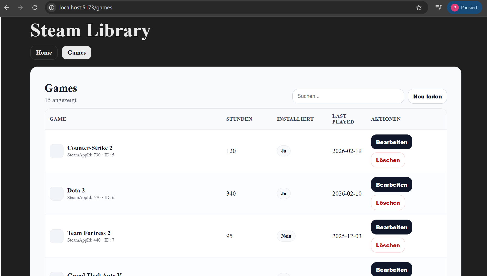

# Projektübersicht

## Projektname
Steam Library App (M295 / M223)

## Projektidee

Die Applikation „Steam Library App” ermöglicht die Verwaltung einer persönlichen Spielebibliothek.

Benutzer können Spiele erfassen, bearbeiten, löschen und filtern.
Alle Daten werden persistent in einer relationalen MySQL-Datenbank gespeichert.

Das Projekt wurde in zwei Modulen entwickelt:

- **M295** – REST-API mit Spring Boot, JPA/MySQL, Validierung, Fehlerbehandlung und Unit-Tests
- **M223** – Erweiterung zur Multi-User-Web-App: JWT-Authentifizierung, Spring Security, RBAC (Role-Based Access Control) und React-Frontend mit geschützten Routen

---

## Ziel des Projektes

Am Ende des Projektes soll:

- eine vollständig lauffähige REST-API mit JWT-Authentifizierung vorhanden sein
- eine relationale Datenbank für Spiele und Benutzer verwendet werden
- CRUD-Operationen über REST mit Rollenprüfung (ROLE_USER / ROLE_ADMIN) bereitgestellt werden
- Registrierung und Login über dedizierte Auth-Endpunkte möglich sein
- ein React-Frontend mit Login-, Register- und Games-Seite vorhanden sein
- geschützte Routen (PrivateRoute) nur für authentifizierte Benutzer zugänglich sein
- Validierung und Fehlerbehandlung implementiert sein
- eine vollständige Projektdokumentation vorliegen

# Story Board

# Mockups

