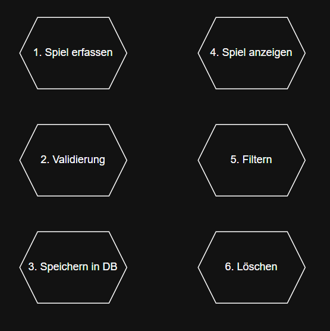

# Projektübersicht

## Projektname
Steam Library REST-API (M295)

## Projektidee

Die Applikation „Steam Library REST-API“ ermöglicht die Verwaltung einer persönlichen Spielebibliothek.

Benutzer können Spiele erfassen, bearbeiten, löschen und filtern.  
Alle Daten werden persistent in einer relationalen MySQL-Datenbank gespeichert.

Der Fokus des Projektes liegt auf einer sauberen REST-Architektur mit Spring Boot, 
serverseitiger Validierung, Fehlerbehandlung und Unit-Tests.

---

## Ziel des Projektes

Am Ende des Projektes soll:

- eine vollständig lauffähige REST-API vorhanden sein
- eine relationale Datenbank verwendet werden
- CRUD-Operationen über REST bereitgestellt werden
- Validierung und Fehlerbehandlung implementiert sein
- eine vollständige Projektdokumentation vorliegen

# Story Board

