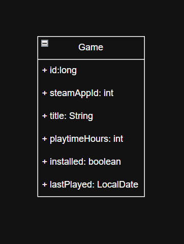

# Architektur

## Technologie-Stack

### Backend
- Java 25
- Spring Boot 3.3.2
- Spring Security 6
- JJWT 0.12.6 (JWT-Bibliothek)
- Maven
- MySQL 8 (Docker)
- JPA / Hibernate
- JUnit 5 / MockMvc (Tests)

### Frontend
- React 18
- React Router v7
- Vite
- Context API (AuthContext)

---

## Systemarchitektur (M295)

Die Architektur folgt dem klassischen Schichtenmodell:

```
Client → Controller → Repository → Datenbank
```

1. Ein Client sendet einen HTTP-Request an die REST-API.
2. Der Controller verarbeitet die Anfrage.
3. Die Daten werden mittels Bean Validation validiert.
4. Das Repository greift über JPA auf die MySQL-Datenbank zu.
5. Eine strukturierte JSON-Response wird zurückgegeben.

---

## Systemarchitektur (M223 – mit JWT Security)

Mit der Einführung von Spring Security und JWT wurde die Architektur um einen Security-Layer erweitert:

```
Browser (React)
    ↓  HTTP Request + Authorization: Bearer <JWT>
JwtAuthFilter (OncePerRequestFilter)
    ↓  Token validieren → Principal setzen
SecurityConfig (FilterChain)
    ↓  RBAC: Rollenprüfung pro Endpunkt
Controller (GameController / AuthController)
    ↓
Repository → MySQL Datenbank
```

### Ablauf eines gesicherten Requests

1. Der Browser sendet einen Request mit dem JWT-Token im `Authorization`-Header.
2. Der `JwtAuthFilter` liest und validiert den Token.
3. Bei gültigem Token wird der Benutzer als `UsernamePasswordAuthenticationToken` im `SecurityContext` gesetzt.
4. Die `SecurityConfig` prüft anhand der Rolle, ob der Zugriff erlaubt ist.
5. Bei ROLE_ADMIN: voller CRUD-Zugriff. Bei ROLE_USER: nur GET-Zugriff. Ohne Token: HTTP 401.

---

## Datenmodell

### Entität: Game

| Attribut | Typ | Constraints | Beschreibung |
|----------|------|-------------|-------------|
| id | Long | PK, Auto | Primärschlüssel |
| steamAppId | Integer | NOT NULL, UNIQUE | Eindeutige Steam-App-ID |
| title | String | NOT NULL, NotBlank | Name des Spiels |
| playtimeHours | Integer | PositiveOrZero | Spielzeit in Stunden |
| installed | Boolean | – | Installationsstatus |
| lastPlayed | LocalDate | – | Datum der letzten Nutzung |
| price | Double | PositiveOrZero | Preis in CHF |

### Entität: User (M223)

| Attribut | Typ | Constraints | Beschreibung |
|----------|------|-------------|-------------|
| id | Long | PK, Auto | Primärschlüssel |
| username | String | NOT NULL, UNIQUE | Benutzername |
| email | String | NOT NULL, UNIQUE | E-Mail-Adresse |
| password | String | NOT NULL | BCrypt-Hash des Passworts |
| roles | Set\<ERole\> | ElementCollection | Rollen des Benutzers |

### Enum: ERole

| Wert | Bedeutung |
|------|-----------|
| ROLE_USER | Lesezugriff auf GET-Endpunkte |
| ROLE_ADMIN | Voller CRUD-Zugriff |

---

## API-Endpunkte

### Auth-Endpunkte (öffentlich)

| Methode | Pfad | Beschreibung | Request Body |
|---------|------|-------------|-------------|
| POST | /api/auth/signup | Benutzer registrieren | `{ name, email, password }` |
| POST | /api/auth/signin | Einloggen, JWT erhalten | `{ username, password }` |

### Game-Endpunkte (geschützt)

| Methode | Pfad | Rolle | Beschreibung |
|---------|------|-------|-------------|
| GET | /games | USER, ADMIN | Alle Spiele abrufen |
| GET | /games/{id} | USER, ADMIN | Spiel nach ID abrufen |
| POST | /games | ADMIN | Neues Spiel erstellen |
| PUT | /games/{id} | ADMIN | Spiel aktualisieren |
| DELETE | /games/{id} | ADMIN | Spiel löschen |

---

## Klassendiagramm (M295)


Mit M223 wurde die Entität `Game` um die Entität `User` ergänzt. Die beiden Entitäten stehen in keiner direkten JPA-Beziehung — ein Benutzer verwaltet die gesamte Spielbibliothek über sein Token und seine Rolle.
